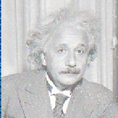

# PGM Image Editor in C language
This program was developed as part of the course "MAC2166 - Introduction to Computation for Engineers", offered by the Institute of Mathematics and Statistics (IME) to students at the Polytechnic School (POLI) of the University of São Paulo (USP).

The program is an image editor capable of modifying PGM files. PGM files are image files in which each pixel is represented by a shade of grey that varies from 0 (black) to 255 (white), considering an 8-bit encoding.

The beauty of the program lies in its simplicity, as it allows the user to manipulate an image via transformations and filters by running in the background only a couple of functions.

This project was originally developed in 2009, but considering its ingenuity, I assumed it was worth translating into English and sharing with those who are taking their first steps in programming or C language.

## Setup

1. Download and install your favorite C compiler. I recommend GCC
2. Compile the file `main.c`
```shell
gcc -omain main.c
```
3. Run the generated `main.exe` file


In order to view PGM files, you can download a PGM viewer or use an online tool like [Jim Elder's PGM File Viewer](https://smallpond.ca/jim/photomicrography/pgmViewer/index.html)


## Features
Following are the program commands

### H - Help
Displays a list of program commands

```shell
Enter a command: H
```

### l - Load
Loads a PGM file

```shell
Enter a command: l
Enter the input file name: ./images/house
```

### C - Compare
Compare two images
```shell
Enter a command: C
Enter the file to be compared to: ./images/bridge
```

### x - Crop
Crops the image according to the coordinates of the upper left corner (xsup, ysup) and the lower right corner (xinf, yinf) of the new image

```shell
Enter a command: x
Upper left corner x coordinate: 0
Upper left corner y coordinate: 0
Lower right corner x coordinate: 200
Lower right corner y coordinate: 200
```
|Original |Cropped|
|-|-|
|||

### 1,2,3 - Edge filters
There are three distinct edge filters. Each is calculated as follows in order to enhance the edges of the given image. 

| Filter Name | Formula |
| --- | --- |
|Edge Filter #1|= Dilation - Erosion|
|Edge Filter #2|= Original - Erosion|
|Edge Filter #3|= Dilation - Original|

Edge filters take two arguments: 
1. **The window size**, which is the size of a square matrix to be filled with the surrounding elements of any given pixel and used to calculate that pixel's new value. The window size is equivalent to the number of neighboring pixels that will be considered in the transformation. In this case, the smaller the number, the thinner the edges of the transformed image. 

2. **The threshold "k" value.** Thresholding is applied in order to get enhanced visualization. The threshold parameter "k" indicates a shade of grey. Values above the limit are converted to white (255) and values below the limit are converted to black (0).

```shell
Enter a command: 1
Enter the size of the window: 3
Enter the value of k: 60
```
|Original |Edge Filter #1|
|-|-|
|||


### d - Dilation Filter
The value of each matrix point becomes the maximum of its neighbors

```shell
Enter a command: d
Enter the size of the window: 8
```
|Original |Dilation Filter|
|-|-|
|||

### e - Erosion Filter
The value of each matrix point becomes the minimum of its neighbors

```shell
Enter a command: e
Enter the size of the window: 5
```
|Original |Erosion Filter|
|-|-|
|||


### M - Mean Filter
The value of each pixel is calculated as the arithmetic mean of its neighbors. 

```shell
Enter a command: M
Enter the size of the window: 3
```

|Original |Mean Filter|
|-|-|
|||

### m - Median Filter
The median filter is a common transformation to smooth out noise in digital signals and images. Each point in the matrix is assigned the median of its neighbors. 

```shell
Enter a command: M
Enter the size of the window: 3
```
|Original |Median Filter|
|-|-|
|||


### n - Negative
Inverts the image colors

```shell
Enter a command: n
```
|Original | Negative|
|-|-|
|||

### h - Flip Horizontal
Flips the image horizontally

```shell
Enter a command: h
```
|Original | Horizontal Flip|
|-|-|
|||

### v - Flip Vertical
Flips the image vertically

```shell
Enter a command: v
```

|Original | Vertical Flip|
|-|-|
|||

### r - Rotate
Performs a 90 degree clockwise rotation on the image
```shell
Enter a command: r
```

|Original | Rotated|
|-|-|
|||

### p - Print
Prints the image matrix on the terminal. This is a useful command to inspect the effect of each transformation on small images

```shell
Enter a command: p
```

### s - Save
Saves the loaded image with its corresponding filters and transformations

```shell
Enter a command: s
```

### E - Exit
Exit the program
```shell
Enter a command: E
```
